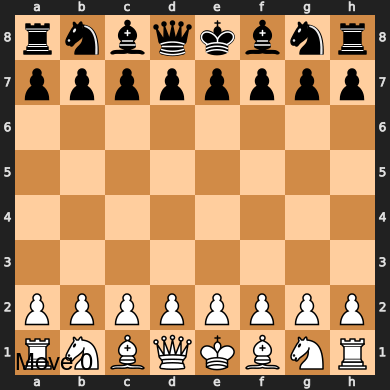

# Gaming Agents
## 📖 Overview

This repository showcases the implementation of popular Game playing algorithms in chess environment.

  - 🔄 **MiniMax**  
  - ✂️ **Alpha-Beta Pruning**

## 🚀 Setup Instructions

Follow these steps to clone the repository, install dependencies, and run the simulations.

### 1. Clone the Repository

```bash
git clone https://github.com/saipreethika12/AgentVerse.git

```

### 2. Set Up and Activate Virtual Environment
```bash
python -m venv venv
venv\Scripts\activate
```

### 3. Install Dependencies

```bash
pip install -r requirements.txt
```

### 4. Run the Simulations

```bash
python Minimax.py
python AlphaBeta.py
```

## Game visualization
### Depth 2

### Depth 3

### Depth 4


